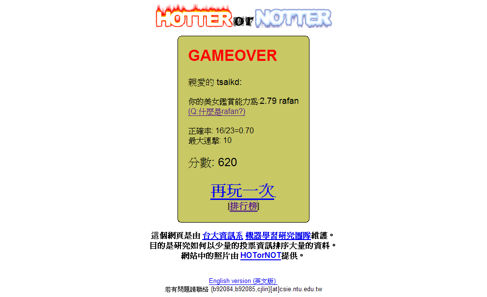

美女鑑賞能力大挑戰

這個是好友 BJ 告訴我的網站

由"台大資訊系 機器學習研究團隊"維護

其實這說穿了就是另一種 "Hot or Not"

不過這種創意還不錯

可是還是有缺點

就是圖片的畫質良莠不齊

遇到畫質好的我心裡多少會加點分

遇到畫質差的我會在腦中重建美女圖

我不知道其他人遇到畫質差的情況會有什麼反應

所以準確度會降低許多

這個應該可以改進的

在挑選圖庫時應該就要把畫質差的過濾掉

這樣才比較具有公平性

---

