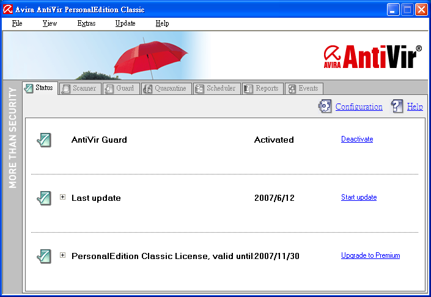

AntiVir PersonalEdition

記得數年前第一次接觸到的防毒軟體是 PC-Cillin

再來是 Norton, ..., Kaspersky

不過上面那些都是屬於商業軟體(要錢的)

不過基於窮學生的關係

所以都....(消音)....

今天問我哥(tsaiid)之後

才知道有個免費而且評價不錯的防毒軟體 -- "AntiVir"

安裝過程也很簡單

感覺還不錯

是該把 Kaspersky 丟掉的時候了...^_^

---

