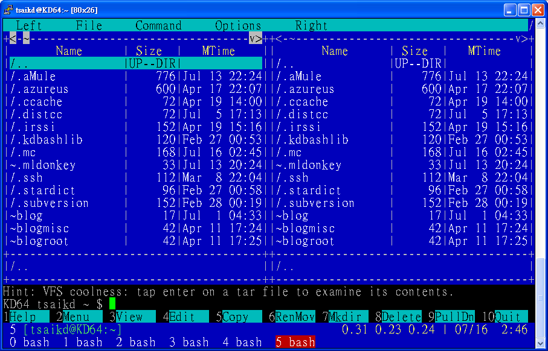

GNU Midnight Commander cli-based file manager


這是一個文字模式的檔案總管

其實在幾個月前就在用這個東西了

現在幾乎每個人都是在圖形介面下操作電腦

不論是用 KDE, Gnome, or Fluxbox ... etc

當然像 KDE 或是 Gnome 都有一套圖形介面的檔案總管可以用

所以一般人是用不到 mc 的

不過我的小 nb 硬碟小

又有雙作業系統

所以只好盡量選擇輕量型的軟體來用

像 KDE 跟 Gnome 都是屬於大怪獸

所以我是用 Fluxbox 來當桌面環境

如果要用 KDE 或是 Gnome 的檔案總管又要裝一堆相關的套件

本來還有 PCManFM 可以選

不過隨著 PCMan 本人開始實習之後

發展的進度好像有點遲緩

然後又不小心看到了 mc 這個東西

可能是習慣的關係

我覺得還有一些小問題

不過總體上算不錯的了

---

一開始遇到的第一個問題就是在 screen 的顯示中排版的問題

加上參數 -a 可以解決

* `mc`


* `mc -a`



---

再來是視窗被切成兩塊了

我想應該很少人會希望檔案總管一次顯示兩個目錄吧

不過 mc 預設就是這樣

雖然這樣有些好處

像是移動檔案的時候就可以迅速的從左邊目錄移到右邊目錄

不過要是沒有用到的話就會覺得另一邊真是佔空間

一開始還不知道要怎麼解決

只能去 `Options -> Layout... -> Panel split ->`


把右邊盡量縮小

雖然看起來有點怪

不過左邊的空間多了許多

剛剛才發現

原來還有另一個更好的解決方法

在 `Left -> Listing mode... -> User defined: ->`

把 half 改成 full 就好了


---

不過又遇到了一個小問題

就是要切換 Listing mode 的話都要從選單上重選一次

而且左右兩個 panel 都要選

不然用 tab 切換 panel 的時候就會覺得怪怪的...@_@

不知道有沒有辦法設定快速鍵來切換 Listing mode ??

---

然後是最麻煩的 binding 問題

就是某類的檔案按下去要用某個程式開啟

雖然程式有預設一個 bindings method

不過顯然程式不夠完善

(要完善太難了...誰知道你裝了多少奇奇怪怪的東西...

還有許多未知的軟體啊...XD)

所以還要根據自己電腦上的環境來做一些設定

這個就需要一點技術了

不過在玩 Linux 的人多少對這些東西有點習慣了

所以看看預設的範例就大概知道怎麼改成自己需要的形式了

不過要是改了的話

程式更新也不會把你自定的 bindings 一起更新

因為改了之後會存在 ~/.mc/bindings

之後程式就只會讀這個檔案

我覺得應該要設計一個 bindings-custom 之類的

除了 default 的 bindings 之外

再 load 這個 bindings-custom

這樣應該比較好

* ~/.mc/bindings

```
...

---

### tsaikd ###

# configure text file

shell/.conf

	Open=%var{EDITOR:vi} %f

---

# video .rmvb .flv .mkv

regex/\.([rR][mM][vV][bB]|[fF][lL][vV]|[mM][kK][vV])$

	Open=(mplayer %f &>/dev/null &)

---

# html .mht

regex/\.([mM][hH][tT])$

	Open=(opera %f &>/dev/null &)

---

### end tsaikd ###

---

...

```
