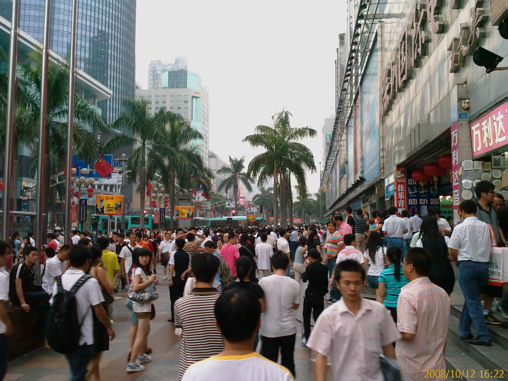
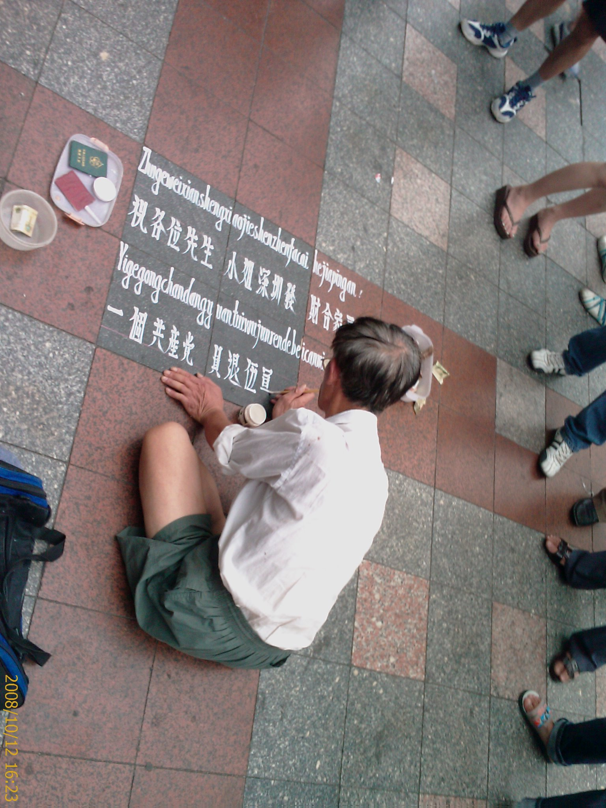

今天早上6:30就自然醒了

不知道為什麼...=.=

---

中午跟一群人到深圳市去吃午餐

認識了一堆人....

好像進了公司後就一直在認識別人....XD

還有幾個是律師耶....

---

午餐平均一個人 60 人民幣

有點高價位

而且其實沒有那麼好吃

雖然還算可以....但是價錢太高了

---

下午到電子廣場逛街

真的是有夠大的

人也超多

---

還有人在地上寫字...Orz

---

一堆大樓林立

每個大樓裡都像光華商場那樣

店家密度還更高

人擠人像是在擠公車一樣...Orz

兩個律師在那邊買了兩隻 iPhone

也在那邊跟店員喇哩(殺價)

我真的覺得我是個非常非常不會殺價的人....

一個下午就這樣過去了....

---

買完東西後我們四個一起逛街的就打 D (搭 Taxi) 回去龍華

律師甲要求司機開高速公路回去比較快

然後路費應該是我們出

不過後來到了龍華下車之後

司機只算跳表的車資

沒算路費

而且律師們還很客氣的幫我跟柏全出車錢

說我們下午陪他們去買 iPhone

其實我們也沒差

反正逛街就是那個樣子啊

讓我覺得有點不好意思

