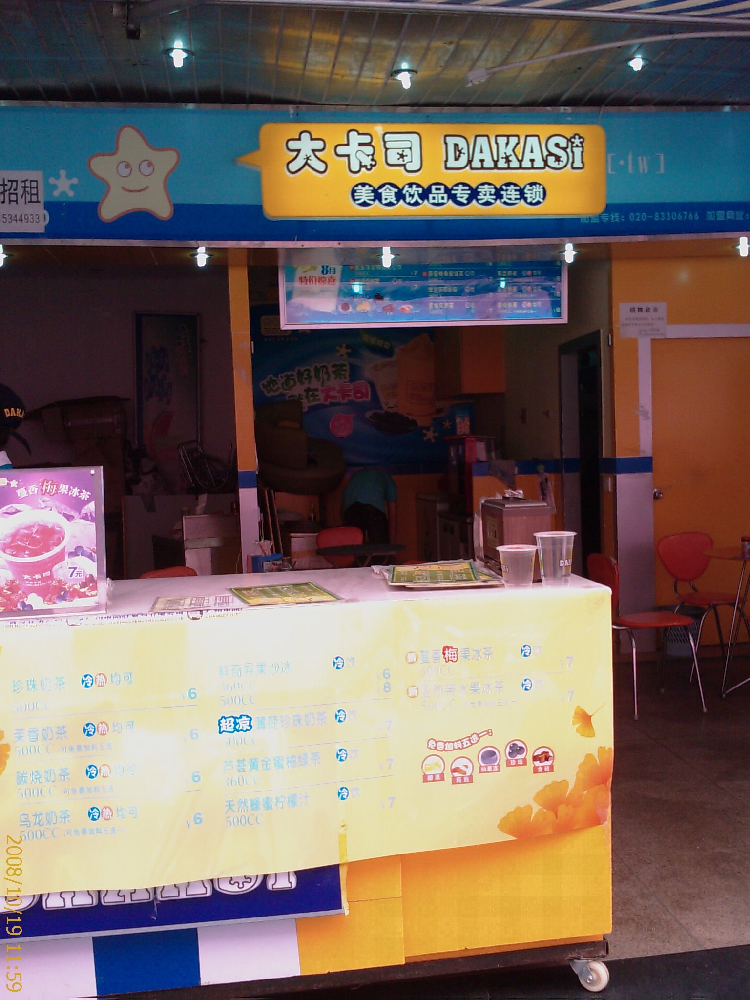

10/18

下班後隨便走走

晚上在某個我忘了名字的公園裡拍的

那個公園還蠻有趣的

裡面竟然有遊戲設施(還是要付費的)

也有一些露天卡拉OK

還有撞球桌跟桌球桌...=.=

公園外圍有一些賣吃的小攤販跟射汽球的攤販

感覺就像夜市一樣了嘛...Orz

---

10/19

因為其他同事都有事情

所以我就只好一個人想辦法找樂子

於是問了要怎麼到深圳市區

這是在等車的旁邊拍到的

這種東西有人會買嗎??敢用嗎??

坐了近一個小時的車之後

到了羅湖火車站

旁邊有個汽車客運站

不知道是開往哪邊的...@_@

---

因為只有華強北電子商廠的印象

所以就先搭地鐵到華強站

想辦法喚起一星期前的記憶

不知不覺快到中午了

隨便找家店祭祭五臟廟

吃飽後不小心看到這家店

因為三聚氫氨的關係

來大陸之後都還沒喝過奶製品

今天終於忍不住了

頂多就是腎結石嘛

很像有什麼超音波可以打掉

衝了

買一杯奶茶來嘗嘗

不過喝起來還是沒像台灣的飲料好喝

而且算起來價錢還蠻貴的

(我拿出手機拍照的時候，女店員還特地躲起來不給我拍...XD)

---

逛了一下電子商場

幫我的手機買個線控

這樣聽音樂就方便多了

---

準備搭地鐵走了

留張照片紀念一下

走過地下道後再來一張

(其實是走錯路....)

---

因為還不確定要怎麼搭車回龍華

早上有在火車站附近看了一下

好像沒看到買票回龍華的地方

所以就早一點搭地鐵回到火車站

順便在附近多逛逛也好

---

在地下一樓看到這個感覺還蠻不錯的

就上來廣場拍照留念

用這種流動的水當天花板

感覺空調的費用應該可以省下不少

而且採光還很棒

只不過好像沒看過用這個當屋頂的房子...@_@

---

又逛了一圈

還是找不到買票的地方

只好打電話求救

原來是在下車的地方直接上車就可以買票了...=.=

結果根本就沒有專門賣票的地方

害我找了好久...@_@

---

這兩張照片是車內的設備

看起來像扶手的東西其實可以變成椅子

這個構想還不錯

增加載客率，節省空間

其實早上搭車來的時候就有用到了

那時候是客滿的狀態

所以就不好拍了

---

不知道為什麼

感覺有點累

車開了之後沒多久就睡著了

還好快到的時候有突然醒來

因為車子的終點不是我的目的地

要是睡死了就要準備再花大錢搭 Taxi 回去了...Orz

---

回到家後沒多久

有同事就找我去按摩了

我想說閒閒沒事就跟了

這次的地方跟上次不一樣

整間屋子都充斥著一種不知名的香味

我上次是按泰式的

所以這次就挑日式的試看看

有用精油推背

推背感覺就是把精油塗在背上

然後用手把整個背部搓的熱熱的

之後再用熱毛巾擦一擦

沒什麼特別舒服的感覺

---

在按摩脖子的時候

她還跟我說我的脖子有很多什麼東西

(她說了一個名詞，可惜我聽不懂...@_@)

大概是我常常坐在電腦前所以脖子受不了

沒想到按摩脖子還能看出一些東西啊....

真是佩服佩服!!

---

這次的按摩小姐在相貌上比上次的差一些

不過感覺比較認真一點

所以整體感覺比上次的要好一點

可是還是沒有通體舒暢的感覺啊...@_@

