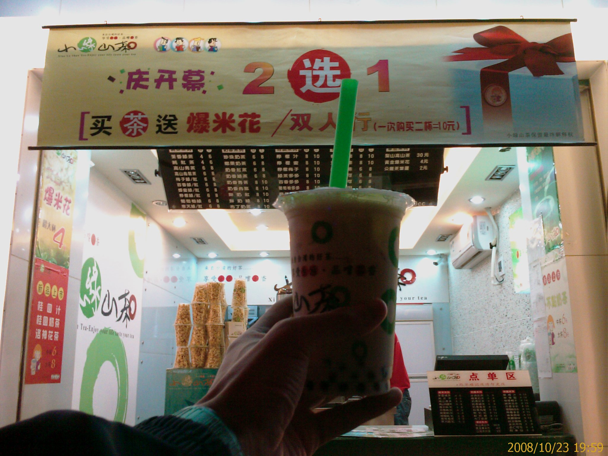

中午跟著兩個同事一起去吃午餐

各點了一道菜

我因為昨天吃太辣了

所以還特地挑一個涼拌皮蛋來中和一下

沒想到端上桌子後竟然也是辣的...=.=

---

晚上為了慶祝某個同事準備換到另一個單位

所以一夥人去吃燒烤

我很白目的點了一個香辣烤羊蹄

服務生還特地提醒我說那個蠻辣的

我還是點了

端上桌感覺還好

味道聞起來很香

上面也沒有看到疑似辣椒的醬汁

咬了一小口

嗯....很像只是微辣....

再多吃幾口....

幹!!超辣的....

還好有點個冰涼的西瓜汁來撐一下

不然我那隻烤羊蹄就吃不下去了

不過一杯西瓜汁配完了

羊蹄還有一點點

只好用溫茶來配

但是效果就差多了

喝了一大口茶只能多吃一小塊羊蹄上的肉

邊吃邊幹

我怎麼這麼白目啊...@_@

不過第一口的味道還真是不錯...Orz

---

吃飽飯跟同事去逛腳踏車店

路過一家飲料店

同事請我喝飲料(大概是看我辣到不行了吧...XD)

---

在腳踏車店看到了一台折疊式電動腳踏車

從外觀上看不出來是電動的

整體造型設計的還不錯

重量是 34 斤(不知道老闆說的斤是哪個單位...@_@)

我有試騎了一下

還蠻舒服的

而且電動的馬力還蠻強的

據說充飽電可以騎 30 公里

一台要價 2680 人民幣

我還真的蠻心動的

不過考慮到要帶回台灣可能不太方便

所以就再看看啦

---

我覺得我常常會忘記拍照

感覺很多東西應該都可以拍下來當紀念的...@_@

