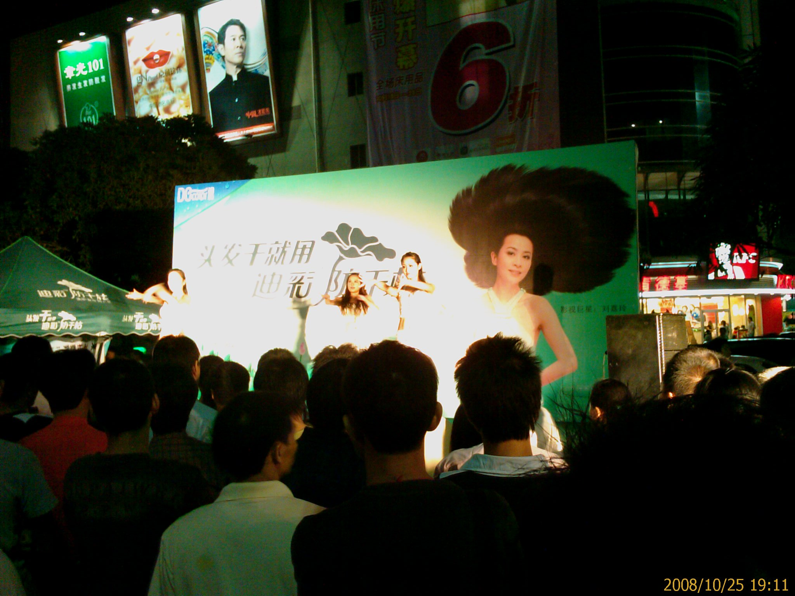

下班後天時間還不太晚

就到附近隨便逛逛

---

這附近還蠻多按摩店的

不過價錢還差蠻多的

---

這家 90min 45 塊

---

這家 120min 40 塊

---

最早之前去的那家紅樹林用 Foxconn 工牌打折後是 120 min 70 塊

---

前幾天去的那家不知名的好像也差不多

不過我那次有用精油推背

所以是 120 min 110 塊(精油一支 30 塊)

---

住宿的部份價錢也差很多

這裡看到一家只要 5 塊的

不知道裡面的設備是怎樣...@_@

不過不管怎麼樣

5 塊也有點太扯了吧...Orz

---

後來不小心逛到華X商場(一時想不起名字)

剛好有一個促銷活動請了三個辣妹上台跳舞

我就停下來看一下了...

可惜手機的照像功能太差了

感覺現在的燈光應該還算充足

可是拍起來還是很慘...@_@

是該買台隨身相機了嗎...Orz

---

晚餐跟同事去吃大餐

其實本來要去吃一家比較小的餐廳

不過那家客滿了

所以就轉往另一家更高檔的

我點了一個荷香牛扒飯(不知道跟牛排飯是不是一樣的意思??)

就要 40 塊

一杯皇家咖啡 30 塊

不過因為跟主餐一起點

所以咖啡變 15 塊

再因為有另一個同事是老主顧

所以靠他的名號可以再打 88 折

算起來就是 (40+15) * 0.88

還是很貴...XD

---

皇家咖啡

就是一杯咖啡端到桌子上

上面放個像湯匙的東西

裡面裝著白蘭地跟糖

然後點火把白藍地燒掉...=.=

我只顧著看服務員表演

忘了拍下來...T_T

---

跟我一起來的同事說有個服務員長的很像另一個女同事

我在腦海中無法 match 起來

因為接觸太少了

我想把服務員拍下來回去比較一下

可惜人家不肯給我拍...T_T

---

今天聽說下個月就沒有專車接送上下班了

(其實之前就有傳言了....只不過今天算是確定了吧)

所以想說弄個交易工具好了

之前看到電動折疊車感覺不錯

就上網找看看有沒有其他的

結果在奇摩拍賣看到一個 易精靈 (EZ bike) 折疊電動車

看起來真符合我的需要啊

可惜我現在在龍華...@_@

考慮在這邊買這台還是要回台灣買那台...

