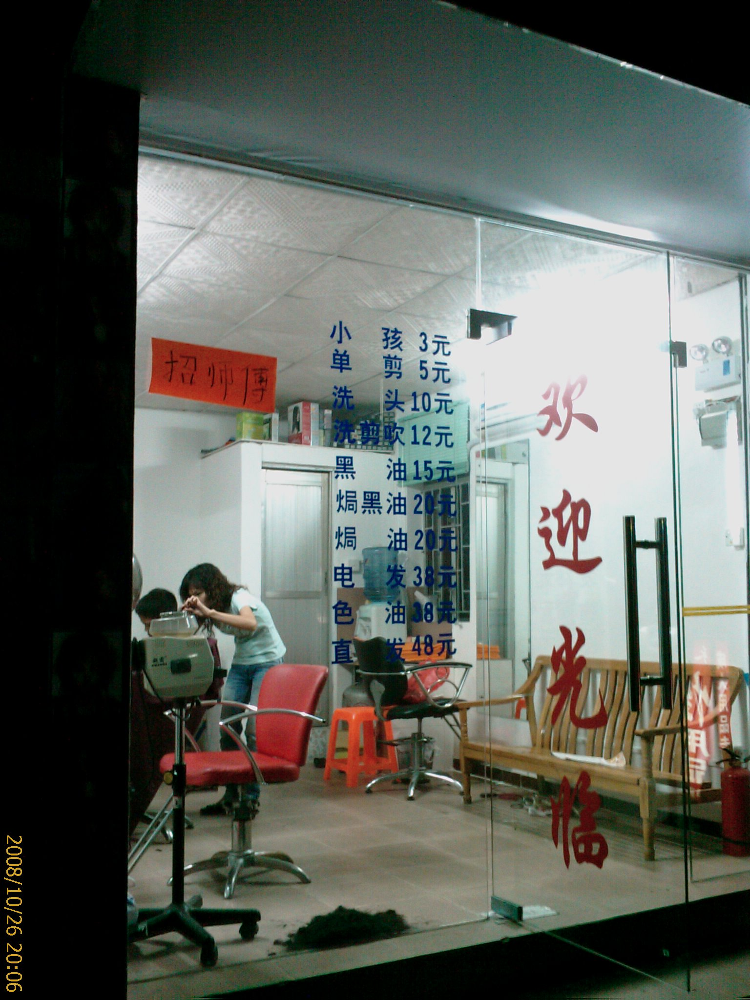
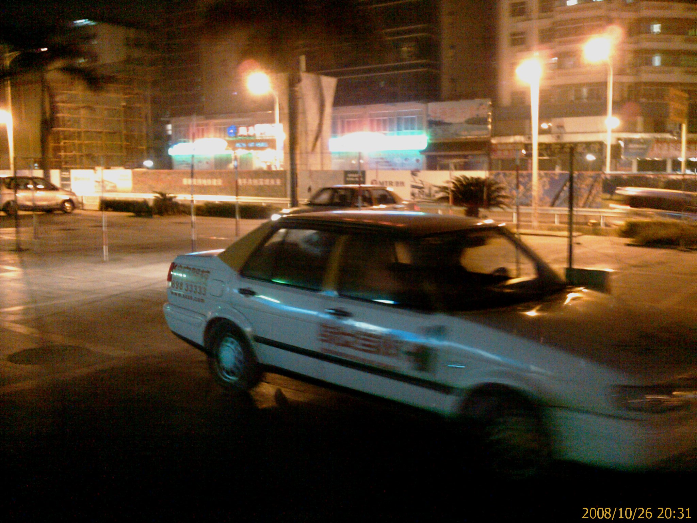

晚上本來要找同事一起吃飯的

結果他跑去關內了...Orz

所以只好又一個人出去覓食

---

晚餐吃的是園中園裡的一家路邊攤

我點的是泰式豬扒飯(這邊的扒應該是排的意思吧!?)

打開來第一眼看覺得很寒酸

連道青菜都沒有

這樣要 7 塊錢

不過把豬排翻開來看才發現菜被壓在下面了...=.=

豬排的味道不錯

應該要歸功於那個醬汁吧

---

吃完之後

因為房間的燈泡四個壞了三個

有點昏暗

(其實一開始住進來就這樣了...@_@)

有通知房東了

可是過了一個星期還是沒有動靜

想說去買一下燈泡自己換好了

結果逛了好久都沒有找到...T_T

---

路過理髮店

好像還蠻便宜的耶

可是回家給媽剪就不用花錢了...XD

---

接到新室友的電話

說他到了

所以就打道回府

去接新室友了...^_^

---

路旁的汽車教練場

還真簡陋啊...@_@

