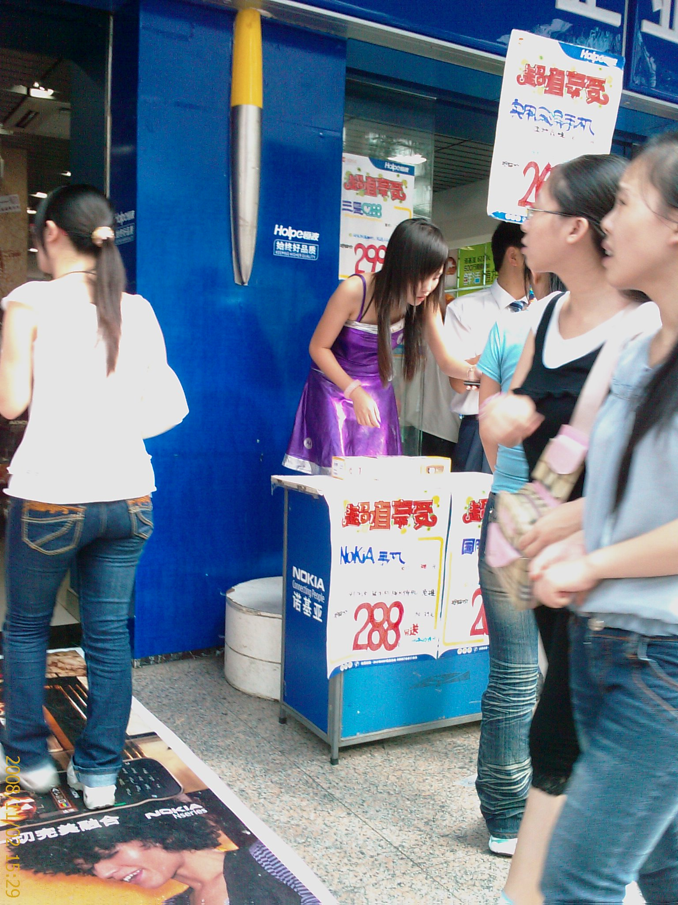
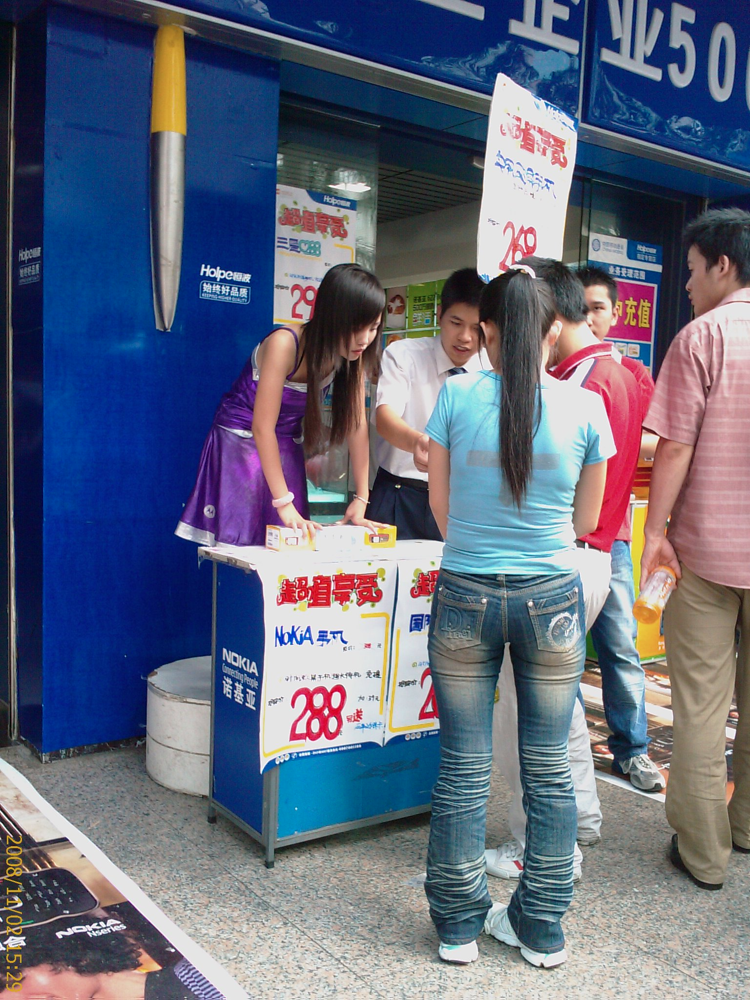
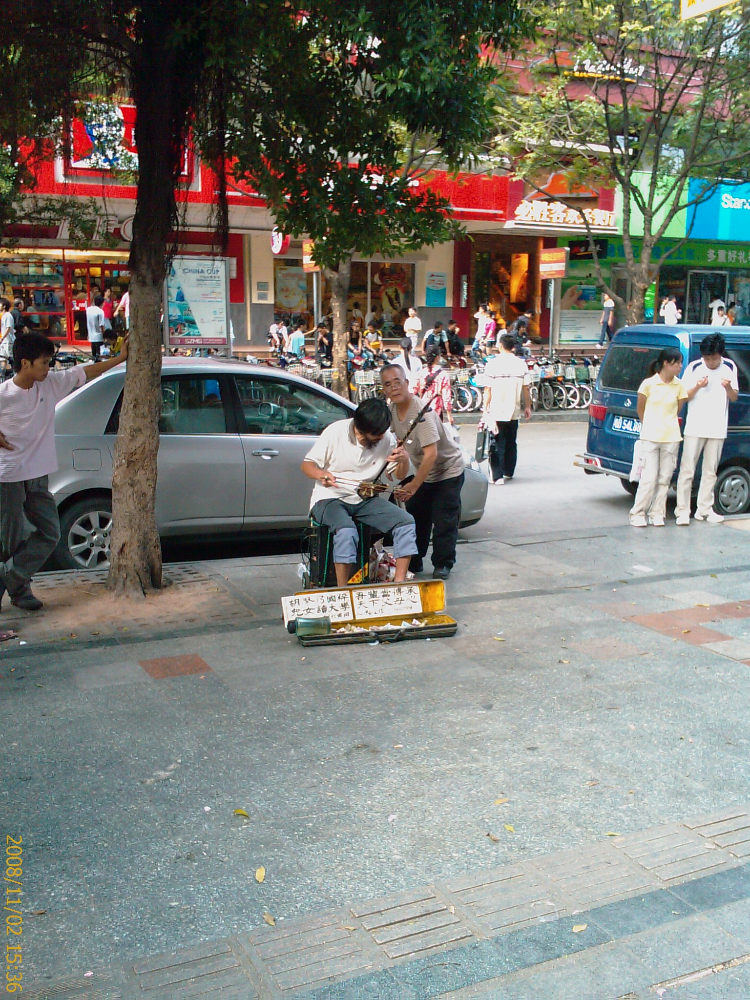
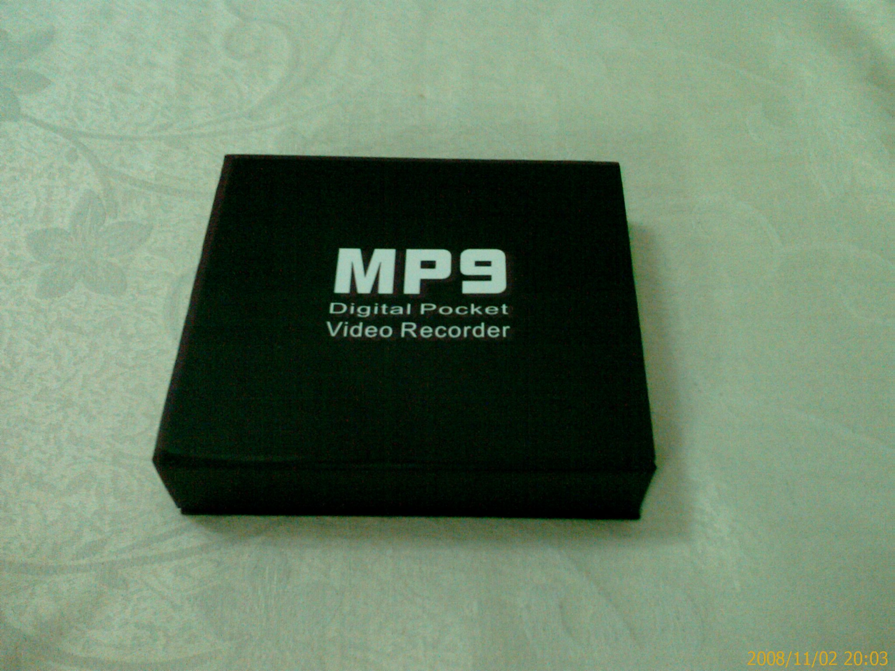
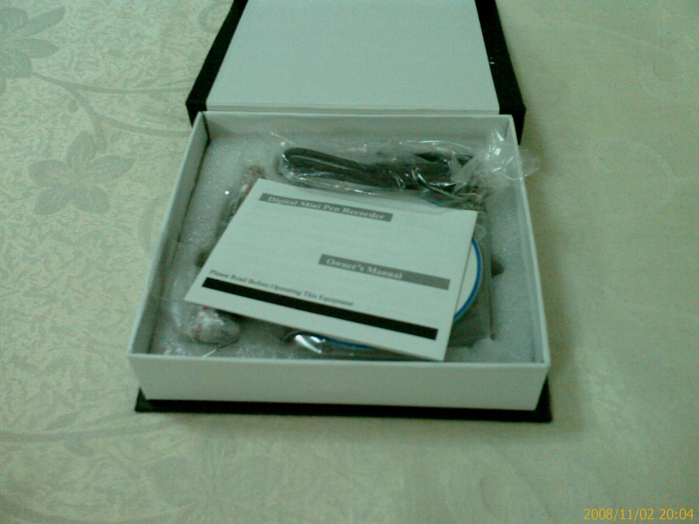
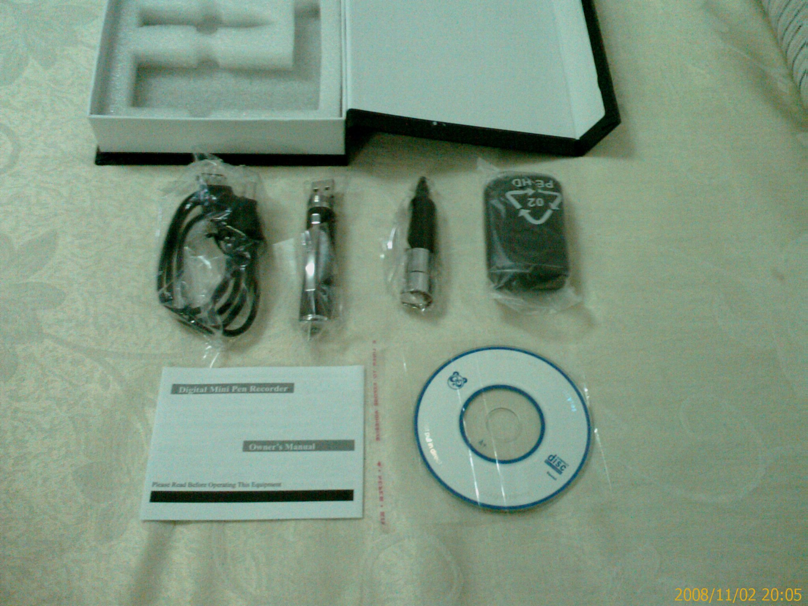
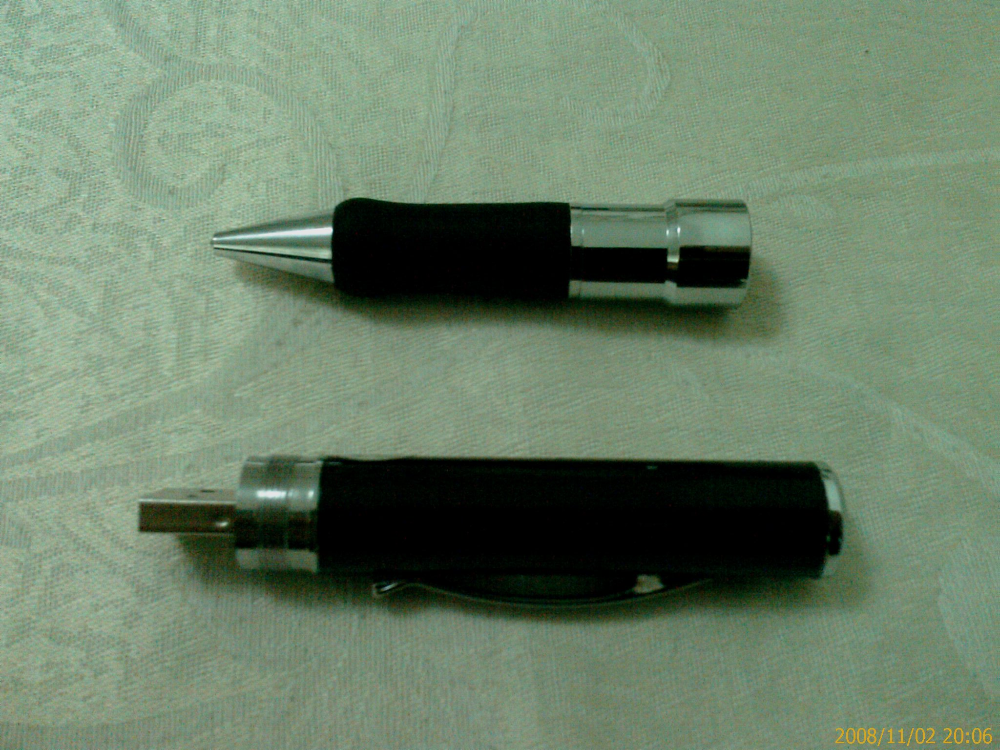
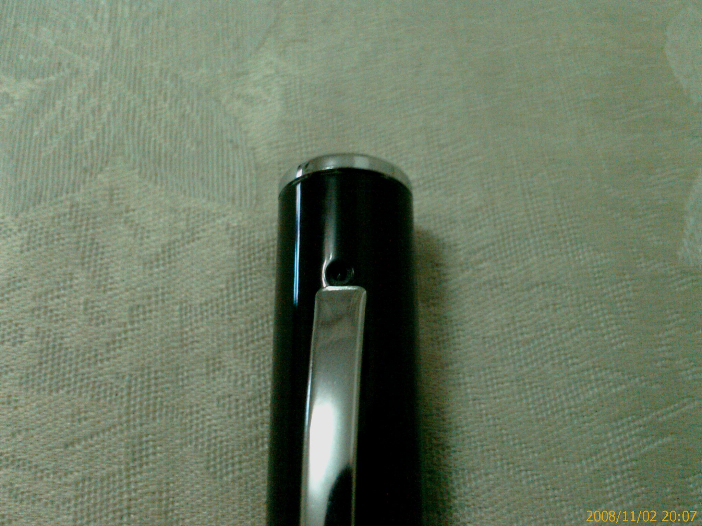
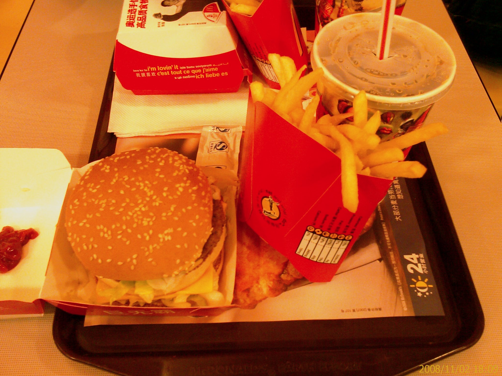

這次是跟著室友一起搭 3 塊錢的公車過來的

雖然有點擠

不過看在 3 塊錢的份上就算了

路上看到 showgirl 站在門口賣東西

---

還有看到有人在路旁拉胡琴

其實常會看到有人拿著胡琴在路邊乞討

旁邊用喇叭放胡琴的音樂來假裝

這次這個是真功夫在拉的

聽起來還有模有樣的

感覺還蠻特別的

---

逛到一個在賣偷拍用的 USB 筆型針孔攝影機

感覺很有趣就買下來了

4G 容量 352x288 像素 280 人民幣

不過回去試用了一下

聲音還蠻清楚的

影像的話如果燈光不夠亮效果就差了

不過錄下來的影片上會有時間

而且是 1980 年的

找了半天找不到怎麼設定正確的時間

雖然有附一張光碟

不過我的 NB 光碟機掛掉了

所以只好等明天去公司才能看到光碟的內容了

---

盒子外觀

開盒照

配件

上面是筆，下面是 USB 加上 Camera

Camera 特寫

---

買完了之後本來想直接搭公車回去的

不過看到公車上像是在擠沙丁魚

所以就決定先去吃飯了

因為也不知道要吃什麼

又不小心走到麥當勞附近

所以就去吃麥當勞了

---

這份套餐 21 人民幣

不愧是跨國連鎖店

味道跟台灣的差不多

---

解決晚餐之後

就準備搭公車回去

一走到馬路上就看到一台空空的公車開過來

想說這頓飯吃的時間點不錯

沒想到等到公車停下來開門的時候

旁邊就突然湧出一堆人要擠上公車搶位置

還好我跟室友是在離車門很近的貴賓席

就被人群推上車

然後擠進座位上....

真不愧是深圳啊!!

上個公車都要擠成這樣

一堆人都跌跌撞撞的

也不知道是誰在擠

在台北搭公車雖然有時候人也很多

但也不會像這樣亂擠一通的

真是特別的經驗...@_@

