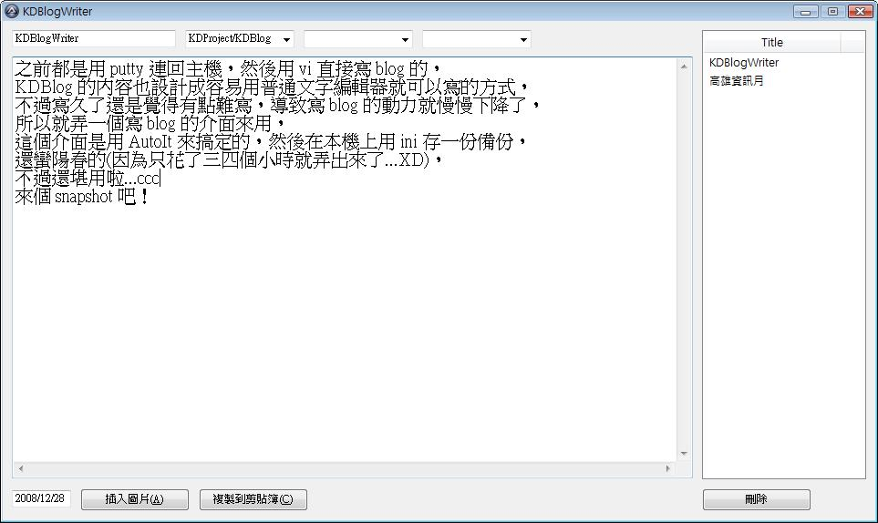

之前都是用 putty 連回主機，然後用 vi 直接寫 blog 的，

KDBlog 的內容也設計成容易用普通文字編輯器就可以寫的方式，

不過寫久了還是覺得有點難寫，導致寫 blog 的動力就慢慢下降了，

所以就弄一個寫 blog 的介面來用，

這個介面是用 AutoIt 來搞定的，然後在本機上用 ini 存一份備份，

還蠻陽春的(因為只花了三四個小時就弄出來了...XD)，

不過還堪用啦...ccc

來個 ScreenShot 吧！

