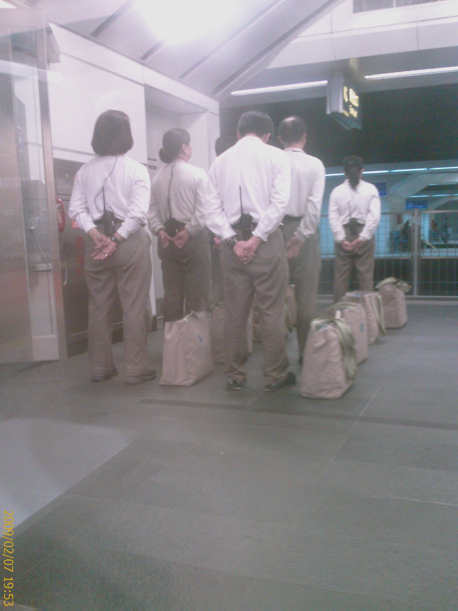

今天在土城公司上完課已經下午五點多了

回宿舍整理一下

再坐公車轉捷運到台北車站就七點了

怕搭客運回高雄太晚沒捷運可以搭回宿舍

就只好搭高鐵回去了

---

今天人很多

買車票的時候七點多的車班都客滿了

只好買八點的

然後準備刷車票進候車區的時候

竟然不給過...

試了兩次還是不行

心理在想這不是剛剛買的車票嗎??

應該沒有什麼問題才對啊

只好找站務人員幫忙

結果得到的回應是...."你拿錯車票了...這是從左營到台北的票..."

...

幹!!

我剛剛買車票之後

把金融卡放回錢包的時候

不小心把卡換掉了....

冏興...

---

再把正確的車票拿出來刷....

竟然還是不給過...

試了兩次還是不行

心理在想這的確是剛剛買的車票啊

應該不會有問題啊

只好再找站務人員幫忙

結果得到的回應是...."這是八點的車班...只能提前 40 分鐘才能進到候車區"

---

真不愧是高鐵啊!!

我搭台鐵這麼久還沒遇過這種不能提前進場的情況....

---

好不容易進了火車上

竟然看到外面有工作人員在排隊!!

---

這裡是軍隊嗎??

還是要打仗了...??

真不愧是高鐵....

連工作人員都搞的像軍隊一樣....

佩服佩服!!

