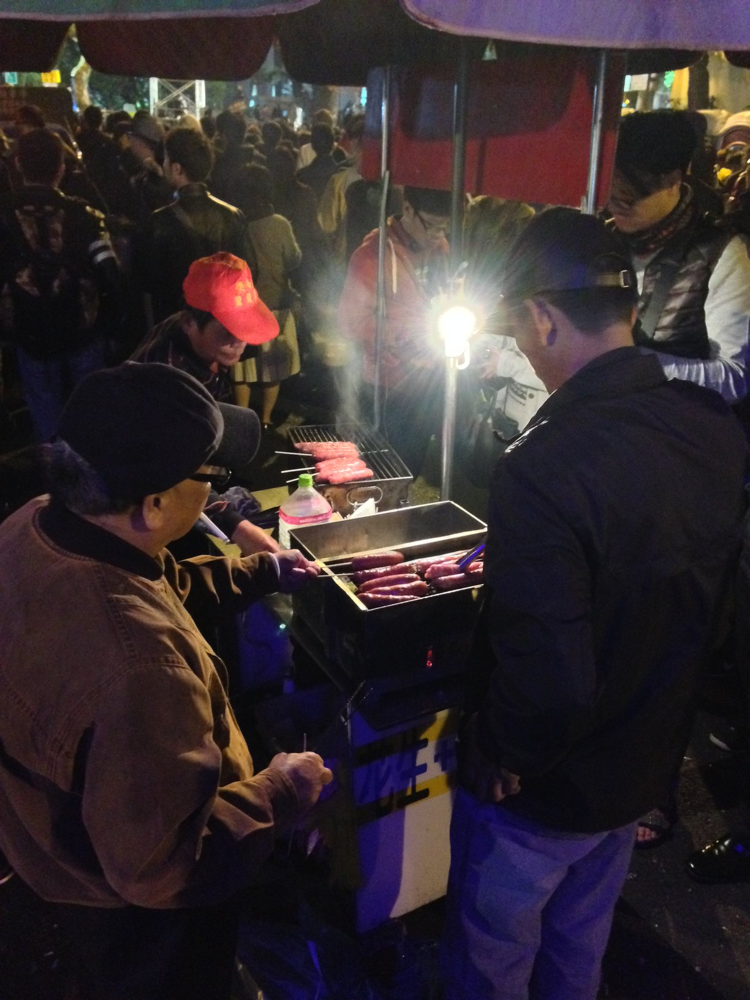
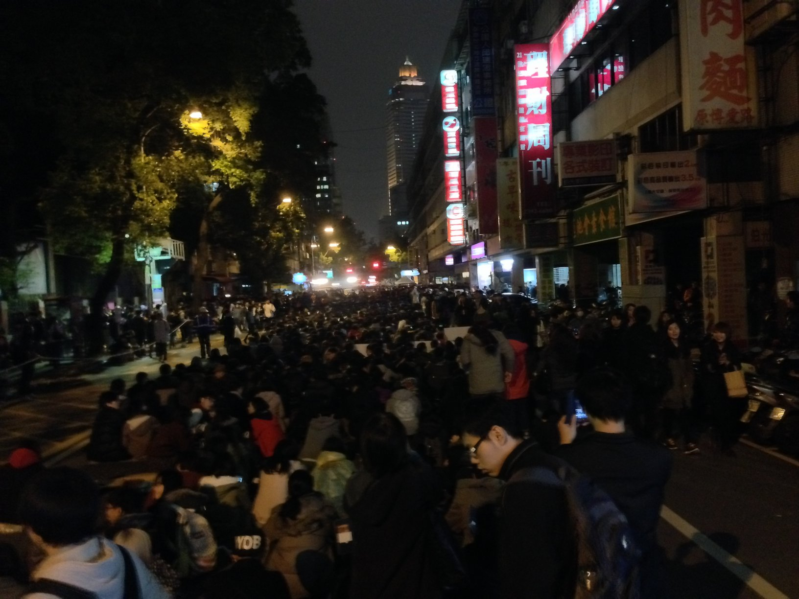

2014-03-20 今天氣溫驟降，我天真的以為今天立法院那邊的人會比較少，
可能需要有人頭去幫忙加油打氣，於是我就出發了。
跟上篇一樣，先從描述事實開始。

一開始就看到一個計程車司機自備麥克風站在車頂上。

人群前面有一攤烤香腸，我原本以為是善心民眾來提供熱食，後來在旁邊站了一下，一條40塊...=.=

今天人潮比昨天多。

民眾被採訪了，不知道是哪個媒體。

--------------------------------

事實描述完畢，接下來就是心得了。

趁這個反黑箱服貿協議風潮，果然一些有沒有的現象都會出現，
這個集會的主要目標是定在反黑箱服貿上面，
一堆不是直接相關的議題都被拉進來搭順風車。

看到那個烤香腸，我突然能理解之前凱道夜市是怎麼回事了...
果然個人利益才是王道！

在人群中看到有人舉牌希望大家關掉 3G ，讓場內的訊息能傳出來，
我在想，新聞自由可以捨棄，但網路應該會是最後一道防線，
如果連網路都像大陸那樣封鎖的話，那就真的 GG 了...
印象中有看到一些消息是 NCC 要立法管制網路，現在不知道怎麼樣了？

今天，人潮眾多，出乎意料，氣溫偏低，偶下小雨，
明天上班，回家休息，大家加油，安全第一。
