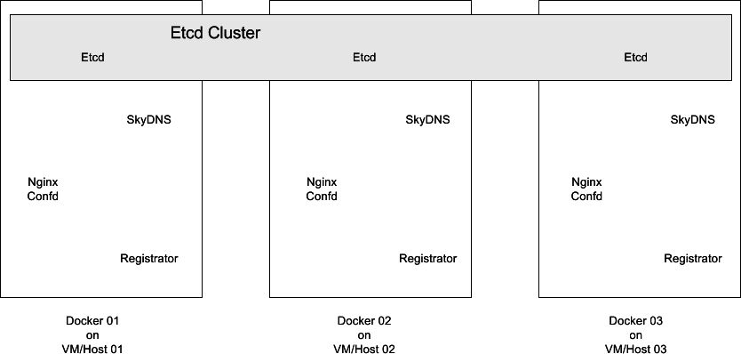
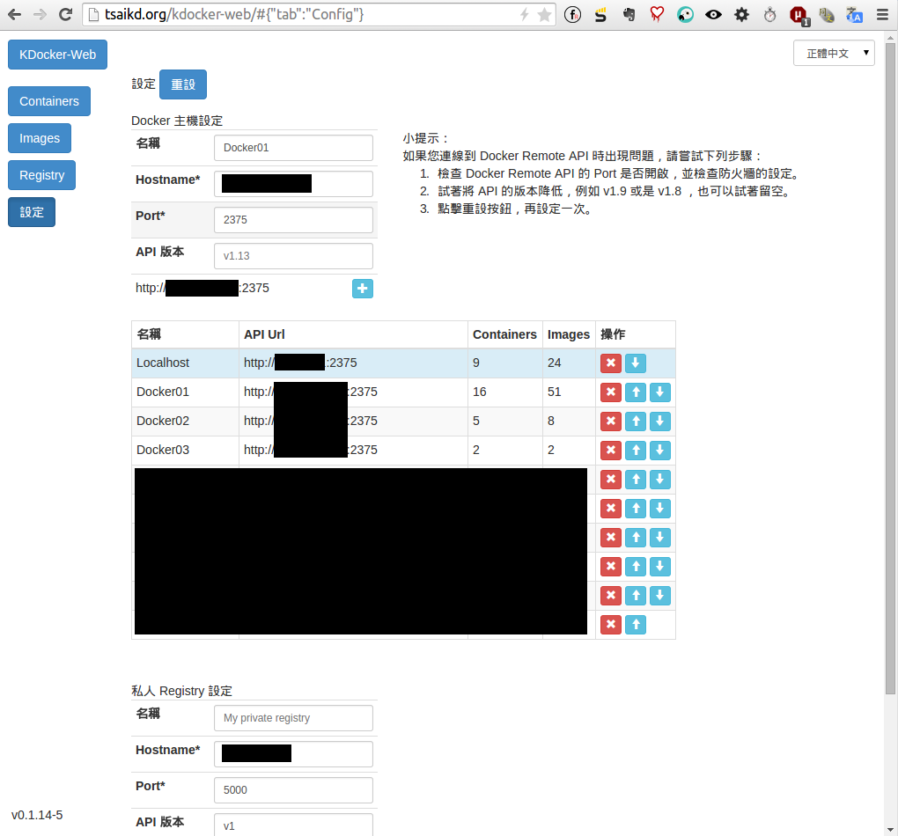

[Docker]: https://www.docker.io/
[Docker Hub]: https://registry.hub.docker.com/
[Etcd]: https://github.com/coreos/etcd
[SkyDNS]: https://github.com/skynetservices/skydns
[Registrator]: https://github.com/progrium/registrator
[Nginx]: http://nginx.com
[Confd]: https://github.com/kelseyhightower/confd
[Fig]: http://www.fig.sh/
[Docker-Builder]: https://github.com/tsaikd/docker-builder
[KDocker-Web]: http://tsaikd.org/kdocker-web/
[Ubuntu]: http://www.ubuntu.com/
[ElasticSearch]: http://www.elasticsearch.org/

## 這邊介紹的架構可以做到什麼效果?
* 開新的 Web App 就可以立刻透過新的 domain name 去連線
* 開一大堆同名的 Web App 就可以立刻分流

----

## 系統基本架構圖


* [Etcd][]
	* 存放設定的 Cluster DB
<br/>
<br/>

* [SkyDNS][]
	* 從 [Etcd][] 讀取設定, 讓使用者查詢的 DNS Server
	* 
<br/>
<br/>

* [Confd][]
	* 從 [Etcd][] 讀取設定, Reload [Nginx][]
	* 
<br/>
<br/>

* [Registrator][]
	* 監聽 [Docker][] Events, 將 Container 資訊寫入 [Etcd][]
	* 
<br/>
<br/>

* [Nginx][]
	* 網頁 r-Proxy
	* 

----

## 實作部份

### 準備 VM/Host
如果只是要先測試的話, 可以只用一台 VM/Host,
不過考慮到系統容錯的話, 建議準備至少三台不同的機器來建構底層架構

### 設定 [Docker][]

這邊在 [Ubuntu][] 上安裝 [Docker][] 做為範例, 其他平台請參考[官網說明文件](https://docs.docker.com/)

* 利用 apt 安裝 lxc-docker

```
echo "deb http://get.docker.io/ubuntu docker main" > /etc/apt/sources.list.d/docker.list
apt-get update
apt-get install lxc-docker
```

* 開放 tcp 2375 port 方便透過 [KDocker-Web][] 進行 [Docker][] 觀察, 不過正式環境最好不要隨意開放 docker socket port
	* /etc/default/docker

	```
DOCKER_OPTS="$DOCKER_OPTS --api-enable-cors=true -H tcp://0.0.0.0:2375 -H unix:///var/run/docker.sock"
	```

* 連線到 [KDocker-Web][] 進行設定, 這是一個純網頁的 Web App , 在上面進行設定並不會造成資料外洩, 請安心服用...XD
	* 

----

### 用 [Docker-Builder][] 建立私有的 image
* 把專案 clone 下來

```
git clone https://github.com/tsaikd/docker-builder
cd docker-builder
```

* 在設定檔填上自己喜歡的名字, 如果你不想在 [Docker][] Image 列表看到一堆 tsaikd 的話...XD

```
echo 'export DOCKER_BASE="tsaikd"' >> config.sh
```

* 時區調整一下

```
echo 'export TIMEZONE="Asia/Taipei"' >> config.sh
```

* 我通常會用 apt proxy 來加快 build 的速度

```
echo 'export APT_PROXY="http://YOUR_APT_PROXY:PORT/"' >> config.sh
```

* 先從 [Docker Hub][] 抓基本的 Image

```
docker pull ubuntu:14.04
```

* 把等一下會用到的 image 一次 build 完吧

```
./build.sh ubuntu/stable net-dns/skydns/2.0.1d www-servers/nginx/ppa www-servers/nginx/confd dev-db/etcd/2.0.0-rc.1 sys-docker/registrator/20141218
```

----

### 用 [Fig][] 來啟動 Docker Container

* 安裝 [Fig][], 因為 [Docker-Builder][] 是利用 bash 當作 entrypoint, 所以需要在啟動 container 時加上 interactive 的參數,
不過目前官方的 [Fig][] 還不支援 interactive 參數, 所以要加上 [我的 patch](https://github.com/docker/fig/pull/566),
也可以從 [這邊](https://github.com/tsaikd/fig/releases/download/1.0.1-KD-2/fig-linux-x64) 直接下載執行檔
* 建立 [Fig][] 專案目錄

```
mkdir -p /docker-run/Docker01/
```

* 測試環境
	* VM/Host 01
		* 192.168.0.1
	* VM/Host 02
		* 192.168.0.2
	* VM/Host 03
		* 192.168.0.3
	* 網域
		* localnet.local

* `/docker-run/Docker01/fig.yml`

```
etcd:
  image: tsaikd/dev-db.etcd:2.0.0-rc.1
  interactive: true
  environment:
    - SERVICE_NAME=etcd
    - ETCD_NAME=infra1
    - ETCD_INITIAL_CLUSTER=infra1=http://192.168.0.1:2380,infra2=http://192.168.0.2:2380,infra3=http://192.168.0.3:2380
    - ETCD_INITIAL_ADVERTISE_PEER_URLS=http://192.168.0.1:2380
    - ETCD_LISTEN_PEER_URLS=http://0.0.0.0:2380
    - ETCD_LISTEN_CLIENT_URLS=http://0.0.0.0:2379,http://0.0.0.0:4001
    - ETCD_ADVERTISE_CLIENT_URLS=http://192.168.0.1:2379,http://192.168.0.1:4001
    - ETCD_DATA_DIR=/default.etcd
    - DOCKER_WAITEXIT=1
  ports:
    - 2379:2379
    - 2380:2380
    - 4001:4001
  volumes:
    - /docker-data/etcd:/default.etcd
```

>* etcd 如果不想要跑 cluster 的架構也可以

```
registrator:
  image: tsaikd/sys-docker.registrator:20141218
  hostname: Docker01
  interactive: true
  environment:
    - ETCD_TMPL_PROXY={{if .Attrs.proxy}}/reg/proxy/{{.Attrs.proxy}}/{{.Name}}/{{.ID}} {{.Published.HostIP}}:{{.Published.HostPort}}{{end}}
    - ETCD_TMPL_SKYDNS={{if .Attrs.dns}}/skydns/local/localnet/{{.Attrs.dns}}/{{.ID}} {"host":"{{.Published.HostIP}}","port":{{.Published.HostPort}}}{{end}}
    - ETCD_TMPL_PROXYDNS={{if .Attrs.proxydns}}/skydns/local/localnet/{{.Attrs.proxydns}}/{{.ID}} {"host":"ngconfd.localnet.local","port":{{.Published.HostPort}}}{{end}}
    - ETCD_TMPL_ALL=/reg/all/{{.Name}}/{{.ID}} {{.Published.HostIP}}:{{.Published.HostPort}}
    - REGISTRATOR_OPTS=-ip 192.168.0.1 etcd-tmpl://192.168.0.1:4001/
    - DOCKER_WAITEXIT=1
  volumes:
    - /var/run/docker.sock:/var/run/docker.sock:ro
```

>* [Registrator][] 目前原作者版本還沒支援 ETCD_TMPL 的用法, 要用 [bheatwole](https://github.com/bheatwole/registrator) 版本,
相關的 patch 請參考[這裡](https://github.com/progrium/registrator/pull/76),
我也有在 GitHub 上放了[執行檔](https://github.com/tsaikd/registrator/releases/download/20141218/registrator-linux-amd64),
如果是用 [Docker-Builder][] 建立 Image 的話, 應該就沒啥問題
>* 因為 [Registrator][] 需要監聽 [Docker][] 的事件, 所以要把 [Docker][] socket file 掛進 [Registrator][] 的 container

```
skydns:
  image: tsaikd/net-dns.skydns:2.0.1d
  interactive: true
  environment:
    - SERVICE_NAME=skydns
    - ETCD_MACHINES=http://192.168.0.1:4001
    - SKYDNS_DOMAIN=localnet.local
    - SKYDNS_NAMESERVERS=8.8.8.8:53
    - SKYDNS_ADDR=0.0.0.0:1053
    - SKYDNS_OPTS=-verbose
    - DOCKER_WAITEXIT=1
  ports:
    - 53:1053/udp
```

```
ngconfd:
  image: tsaikd/www-servers.nginx:confd
  interactive: true
  environment:
    - SERVICE_NAME=ngconfd
    - SERVICE_80_DNS=ngconfd
    - CONFD_OPTS=-node 192.168.0.1:4001 -verbose -interval=5
    - DOCKER_WAITEXIT=1
  ports:
    - 80:80
    - 443:443
  volumes:
    - ngconfd/confd:/etc/confd
```

>* [Nginx][] + [Confd][] 還需要額外的設定檔

>>* `/docker-run/Docker01/ngconfd/confd/conf.d/nginx.toml`

```
[template]
src = "nginx.tmpl"
dest = "/etc/nginx/sites-enabled/default"
prefix = "/reg"
keys = [
    "/proxy",
]
check_cmd = "/usr/sbin/nginx -t -c /etc/nginx/nginx.conf"
reload_cmd = "/usr/sbin/service nginx reload"
```

>>* [/docker-run/Docker01/ngconfd/confd/templates/nginx.tmpl](nginx.tmpl.txt)

>>>* 這個檔案格式比較特別, 所以另外放...@_@

* 啟動 container

```
fig up -d etcd
fig up -d registrator
fig up -d skydns
fig up -d ngconfd
```

* 把 DNS 指向 [SkyDNS][] 吧 (192.168.0.1:53)

```
vi /etc/resolv.conf
```

----

### 大功告成

開個 Web App 的 container 出來試看看效果吧, 這邊拿 [ElasticSearch][] 來試,
因為每個 [ElasticSearch][] 的畫面都會顯示一個特別的名字

* `fig.yml`

```
estest:
  image: tsaikd/app-misc.elasticsearch:1.4.1
  interactive: true
  environment:
    - SERVICE_NAME=estest
    - SERVICE_9200_PROXYDNS=estest
    - SERVICE_9200_PROXY=http
  ports:
    - 9200
    - 9300
```

* 開起來看看

```
fig up -d estest
```

* 用瀏覽器連看看

```
curl http://estest.localnet.local/
```

* 多開幾台

```
fig scale estest=3
```

* 再用瀏覽器連看看, 多連幾次看看有什麼不一樣

```
curl http://estest.localnet.local/
```

* 如果是跑一般的網站 Container 的話, 在 Chrome 裡面是可以觀察到 HTTP Connection 是會分散到多台 [Nginx][],
像是 HTML 從 192.168.0.1 抓, JavaScript 從 192.168.0.2 抓之類的行為

----

### 版本參考
* [Ubuntu][] 14.04 amd64
* [Docker][] 1.4.1

