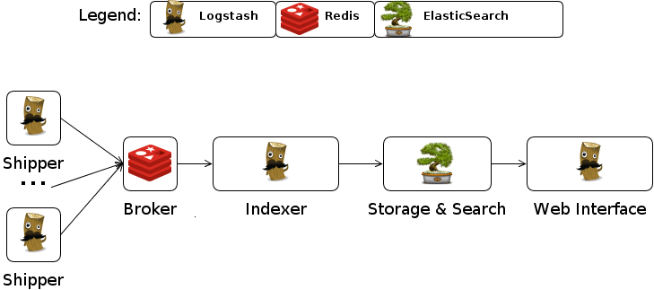
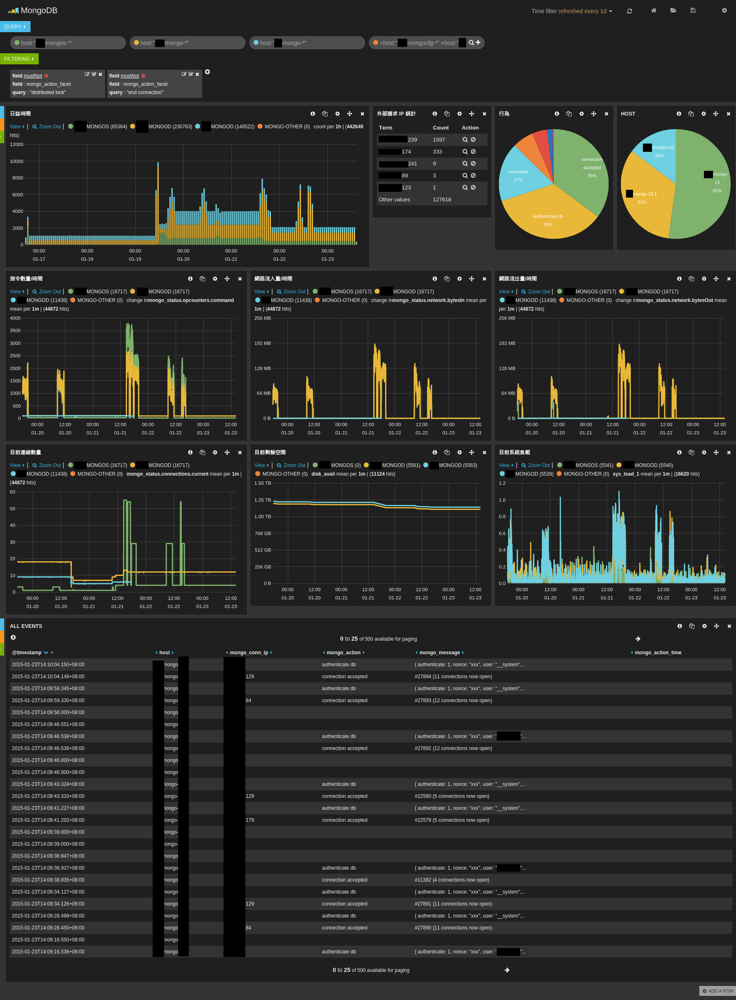

[gogstash]: https://github.com/tsaikd/gogstash
[Logstash]: http://logstash.net/
[MongoDB]: http://www.mongodb.org/
[Ruby]: https://www.ruby-lang.org/zh_tw/
[Java]: https://java.com/zh_TW/
[Redis]: http://redis.io/
[ElasticSearch]: http://www.elasticsearch.org/
[Kibana]: http://www.elasticsearch.org/overview/kibana/
[Lucene]: http://lucene.apache.org/
[Docker]: https://www.docker.com/
[Docker Builder]: https://github.com/tsaikd/docker-builder
[Fig]: http://www.fig.sh/

Log 集中管理可以提供進一步的分析，讓系統管理者在發生問題的時候可以更快的排除錯誤
，也可以看出某些趨勢，提早做出一些可能有影響的決策。目前其實有不少的工具都可以用
在處理 Log 集中管理的問題，我這邊也提供一個中等規模的解決方案。

在小型的環境(單機，少量程式) Log 其實隨便亂放都沒差，通常都只有在出問題的時候才
會去撈 Log 協助排除問題。在大型的環境(數以百計的主機跟 App 以上)，ㄜ~~~~我沒經驗
不敢隨意猜測。所以這邊是用一個數十台 [MongoDB][] 的環境來討論 Log 集中管理的處理
方式。

在 [Logstash][] 的使用情境下，有幾種典型角色：

> [這邊偷用了 Logstash Document 的圖](http://logstash.net/docs/1.1.1/tutorials/getting-started-centralized)

* Shipper
	* 蒐集
* Broker
	* 暫存
* Indexer
	* 解析
* Storage & Search
	* 永久儲存
* Web Interface
	* 分析界面

Shipper + Broker + Indexer 在小型的環境其實可以整合在同一個 [Logstash][] 裡面一次
處理，不過一開始也有提到，在小型的環境，哪有人在搞複雜的 Log 分析...XD，既然要做
就一次做到位吧。

不過這邊還有另一個問題，就是 [Logstash][] 是用 [Ruby][] 寫的，然
後透過 [Java][] 來執行，所以需要安裝 [Java][]，但是像在 [MongoDB][] 的環境，我不
想在機器上安裝太多額外的東西，而且 [Java][] 其實還蠻肥的，如果只是單純的 Shipper
角色，沒有必要搞那麼多有的沒的套件把系統弄髒，所以我另外開發了一個小工具 [gogstash][]
來做 Shipper 的工作。

Broker 選用 [Redis][]，聽說效能不錯？

Indexer 仍然使用 [Logstash][] ，因為 [Logstash][] 已經有蠻多方便的設定可以快速的
解析各式各樣的 Log 。

Storage & Search 選擇 [ElasticSearch][] ，它使用了 [Lucene][] 當基底，可以有效率
的分析及處理各種自然語言，不過其實對一般的 Log 來說，大部分的情況不會用到太深入的
功能，有點用牛刀殺雞的感覺，反正 [ElasticSearch][] 也還蠻好用的，就這樣吧...`^_^`

Web Interface 選擇 3.x 版的 [Kibana][] ，它可以在網頁上展示還不錯看的報表。

## Shipper 設定

[MongoDB][] 的部份這邊先不討論，只是拿來當個案例而已。 Shipper 的重點就是要把所有
機器上的 Log 都送到 Broker ，我這邊想要蒐集的資料包括了 [MongoDB][] 本身的 Log ，
還有機器的狀態也想要一併分析，所以有幾個 [gogstash][] 的設定。

* [蒐集 /var/log/mongodb/mongodb.log](gogstash/mongodb.json)
* [蒐集 MongoDB 服務狀態](gogstash/mongodb-status.json)
* [蒐集硬碟空間使用狀況](gogstash/mongodb-df.json)
* [蒐集系統負載資訊](gogstash/mongodb-sys.json)

## Broker 設定

[Redis][] 要做一個稱職的 Broker 其實有點麻煩，因為它可能是因為效率的問題，在
High availability 方面的設計不是很理想，不過也還算堪用，只是設定上有點難搞...Orz
，我目前使用 [Docker][] 來建構 [Redis][] 環境，裡面有用[我 Patch 過的 Fig](https://github.com/tsaikd/fig)
，另外 Docker Image 是用 [Docker Builder][] 建出來的， [Redis][] 的 sentinel 情況
比較麻煩，可能還是要參考一下[Redis Sentinel 官方文件](http://redis.io/topics/sentinel)
才比較容易理解。底下列出一些相關的設定方式給大家參考。

* [fig.yml](redis/fig.yml)
* [redis/redis.conf](redis/redis/redis.conf)
	* [Redis][] 基本設定
* [redis/sentinel.conf](redis/redis/sentinel.conf)
	* [Redis][] Sentinel 設定
* [redis/start.sh](redis/redis/start.sh)
	* [Docker Builder][] 啟動腳本

## Indexer 設定

Indexer 其實是 Log 分析的一大重點，因為 Log 可能會有各式各樣的描述，再加上每個人
想分析的東西不盡相同，所以很難用一個標準化的設定就能通吃所有情況，這邊我是用 [MongoDB][]
系統管理者的角度來處理 Log。

* [fig.yml](logstash/fig.yml)
* [logstash/index-mongodb.conf](logstash/logstash/index-mongodb.conf)
	* 分析 [MongoDB][] Log
* [logstash/index-mongodb-status.conf](logstash/logstash/index-mongodb-status.conf)
	* 分析 [MongoDB][] 服務狀態
* [logstash/index-mongodb-df.conf](logstash/logstash/index-mongodb-df.conf)
	* 分析硬碟空間使用狀況
* [logstash/index-mongodb-sys.conf](logstash/logstash/index-mongodb-sys.conf)
	* 分析系統負載資訊
* [logstash/start.sh](logstash/logstash/start.sh)
	* [Docker Builder][] 啟動腳本

## Storage & Search 設定

[ElasticSearch][] 最常見的問題其實是它預設在建索引的時候會自動分詞之後才儲存，這
樣會在做分組統計的時候出現狀況，像是 "connection accepted" 這個詞會被拆成 "connection"
"accepted" 這兩個詞來做統計，但是其實我想要的是 "connection accepted" 整個詞來進
行統計，所以某些欄位需要額外設定讓它不要分詞，詳細的設定還是要參考 [ElasticSearch][]
相關文件，底下設定給大家參考。

* [fig.yml](elasticsearch/fig.yml)
* [eslogstash/elasticsearch.yml](elasticsearch/eslogstash/elasticsearch.yml)
	* ElasticSearch 基本設定
* [eslogstash/logging.yml](elasticsearch/eslogstash/logging.yml)
	* 這個檔案基本上沒有修改，只是方便 [Fig][] 直接把整個目錄掛進去
* [eslogstash/analysis/stopword.txt](elasticsearch/eslogstash/analysis/stopword.txt)
	* 用來排除某些特定(不感興趣)的詞
* [eslogstash/analysis/synonym.txt](elasticsearch/eslogstash/analysis/synonym.txt)
	* 設定同義詞
* [eslogstash/templates/kdtmpl.json](elasticsearch/eslogstash/templates/kdtmpl.json)
	* 動態模板，把 `*_facet` 欄位預設成不分詞

## Web Interface 設定

[Kibana][] 的設定就相對簡單很多，主要是因為我用 [Docker][] 把 [Kibana][] 跟 [ElasticSearch][]
的環境分開，不然可以免設定就直接用了。

* [fig.yml](kibana/fig.yml)
* [kibana/config.js](./kibana/kibana/config.js)

## QA

* 上面的 fig.yml 有些奇怪的環境變數像是 `SERVICE_9200_DNS=eslogstash` 是在幹嘛的？

這些是我在 [Docker Infra 架構簡介與實例](../../2014/12-25-Docker-infra) 這邊提到
的架構，其中的某些設定，因為有點複雜，有興趣的就自行閱讀吧，反正把那些服務串起來
就對了。

另外 `DOCKER_WAITEXIT=1` 這個是 [Docker Builder][] 提供的一個設定

## Demo 截圖

